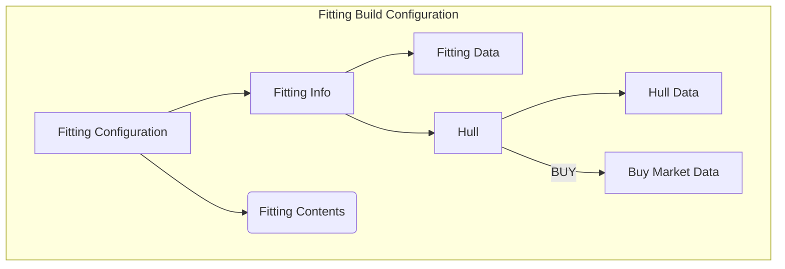
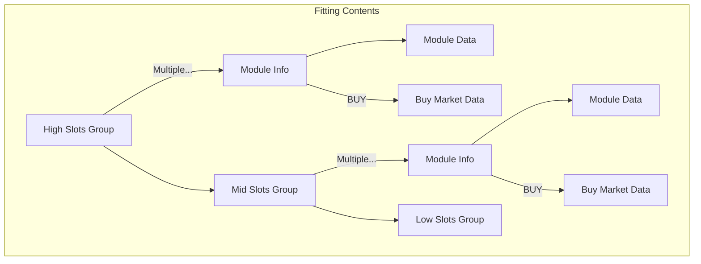

# Project notes
## Fitting build
**Fitting Build Configuration** is a hierarchical render example. A Fitting is composed of different layers of data that are also composed of more data layers.

Starting from the Fitting data itself we found that all Fittings have an unique identifier, a name and description and apply to a specific hull class and hull type.

But if a Fitting is viewed from the Build Configuration side we have to add aggregated data like the toal build cost, the number of build jobs required and the time to build a copy.

Then at the next layer we have the hull section and the contents section. And this layer can also be divided into HIGH slots, MID slots, LOW slots, RIG slots and a different sort of Cargo bays.

Also this sections can add data if viewed from the Build Configuration view side like the Market location and transactions from where buy them or the distance from the store/buy place and the final manufacturing station or for **build** actions the bill of materials required to complete the industry job.

So each piece of data can be subdivided and can add other views data or aspects depending on the action involved, the view used to render the object or other characteristics.

Typescript class reuse should help to isolate all this aspects by providing with stubs that will only be accessed under the right view and characteristics. For example *Market information* should be an optional aspect for the *Item* access link from the central database. Or *BOM* should also be an optional link from the *Build Action*.

Project development will iterate over some different constructions until a correct set of classes, services and factories will return the best desired result for this data engineering task.

### Fitting Build Configuration
The core element has two sections, the **Fitting Info** and the **Fitting Components**. The first section included the Fitting own data plus the hull additional data. The Fitting Info has a single block of data plus an additional **Market** data block. Also there can be other additional blocks depending on the *build action* selected for the hull.

The second section has a block of data for each fitting composition module. Each of those modules are located on a group block and the number of blocks depends on ship and fitting contents. Each composition module also can have additional data blocks, like *market Data* for BUY actions, *BOM* for BUILD actions or *route data* for MOVE actions.

So a modularized way to view this should include an example of all the possible module/action combinations under acceptance tests to all rendering is checked and validated.

### Fitting Build Configuration. BUY starting point

This diagrams show the data dependencies for the simplest and base Fitting Build configuration where all items, from the hull to all the modules are just bought at the cheapest region market hub.

Version 0.20.0 will then cover this structure and try to render all Fitting data for this initial configuration.
