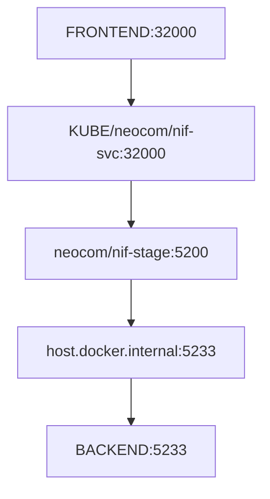

# NETWORK ARCHITECTURE
## Stage services and connections
The services are complex because the localhost usually will be pointing to the docker or kubernetes container and not to the host machine.

```mermaid
  graph TD;
      FRONTEND:32000-->KUBE/neocom/nif-svc:32000;
      KUBE/neocom/nif-svc:32000-->neocom/nif-stage:5200;
      neocom/nif-stage:5200-->host.docker.internal:5233;
      host.docker.internal:5233-->BACKEND:5233;
```
