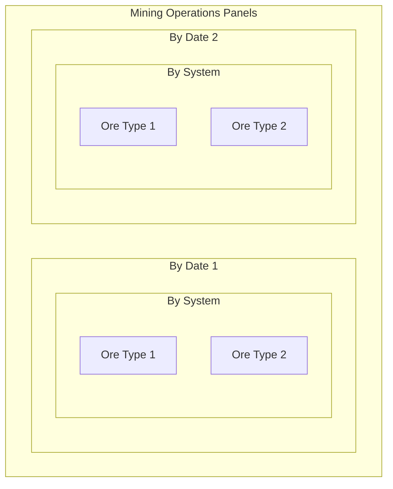
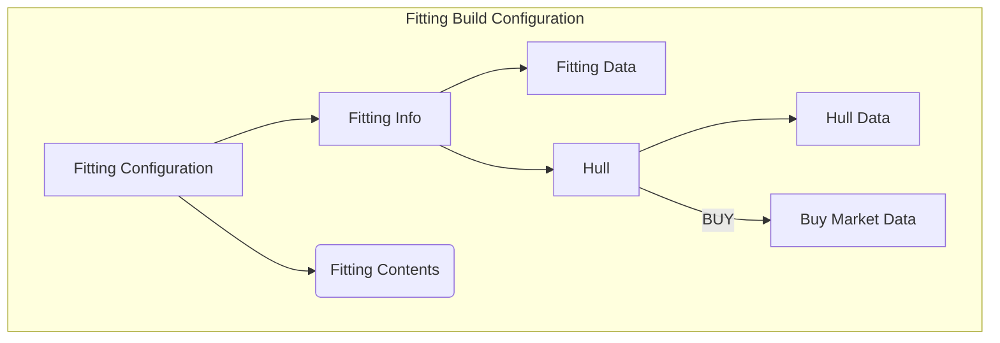
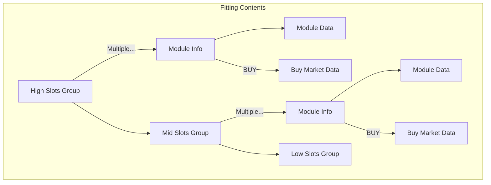

# Neocom Infinity Description
NeoCom Infinity is a new version with a reconfigured User Interface (UX) that aims to a much better user experience and also focusing on features not provided by other tools or that implemented in Infinity have a much better usability.

Developments are mainly docused on Industry and on Market improvements and leaving Fittings and other areas to a later requirement refinement.

## 1. Industry
Industry is a key element on Eve Online and that is because is one of the most stable sources for ISK. It can be divided into two areas, Mining and Manufacturing. Recent changes on the Eve Online gameplay have added more mining functionalities that are worth to integrate on Infinity.

## 1.1 Mining Operations
Now Eve provides an endpoint to return the last ore mineral revocered by mining operations. This will make easy to see the progress on the mining schedule and budget.

The **Mining Operations** activity is under the main dashboard on the **Industry** page under the Mining Operations activation button.

The new Mining Operations Page will display one or two panels. If there are active mining operations during the current date they will be shown on the main panel. If there are no current operations then that panel is not visible.

The second panel is always visible and shows historic mining operations by date. That information is removed after some days (keeps tha tlast **30** days) from the ESI data source so it has to be persisted on the Infinity backend. This mining progress data is updated in a window of no less than **600** seconds.

The presentation selected for the mining operations is a panel for each date and systems. Minig source data comes with the classification ore->system->date. We can aggregate by date and then by system so the panel setup will be:

The aggregation then will show the list of resources mined on that date and system. Ore data is already aggregated. The panel should also show some economic information about the expected value and volume of the panel aggregation. Check if the economic data is undertandable as a whole aggregate or if there should be also some calculation at the ore level.

**[EPIC-0.21]-Add Mining Operations page and functionality to see what is the input form mining.**
* [STORY-NIN] The backend should get the ESI data and aggregate it by system and date. For each system-date pair we generate a single Mining Operation that will contain the list of resources mined for that combination.
* [STORY-NIN] The backend should aggregate economic information to each of the ores on the mining operation. The economic data is the estimated value for the ore at the Amarr hub that is the predefined trading hub.
* [STORY-NIF] Volumetrics can be calculated at the frontend. For each ore the type information provides volume information that can be aggregated by ore and by system-date pair.
* [STORY-NIF] Date is on the format YYYY-MM-DD.
* [STORY-NIF] System information should provide the Region->Constellation->System. The hover over each of the localtion path names should provide the location unique identifier.
* [STORY-NIF] Ore box contents are still under definition. The expected content is the small icon for the ore, the ore name, the stack quantity the estimated economic value and the volume it occupies.
* [STORY-NIF] system-date panel should report information for the date, the system location path and the selected trade hub where the economic data estimation is calculated. It should also show the global volume and the global economic estimated value.

## Fitting build
**Fitting Build Configuration** is a hierarchical render example. A Fitting is composed of different layers of data that are also composed of more data layers.

Starting from the Fitting data itself we found that all Fittings have an unique identifier, a name and description and apply to a specific hull class and hull type.

But if a Fitting is viewed from the Build Configuration side we have to add aggregated data like the toal build cost, the number of build jobs required and the time to build a copy.

Then at the next layer we have the hull section and the contents section. And this layer can also be divided into HIGH slots, MID slots, LOW slots, RIG slots and a different sort of Cargo bays.

Also this sections can add data if viewed from the Build Configuration view side like the Market location and transactions from where buy them or the distance from the store/buy place and the final manufacturing station or for **build** actions the bill of materials required to complete the industry job.

So each piece of data can be subdivided and can add other views data or aspects depending on the action involved, the view used to render the object or other characteristics.

Typescript class reuse should help to isolate all this aspects by providing with stubs that will only be accessed under the right view and characteristics. For example *Market information* should be an optional aspect for the *Item* access link from the central database. Or *BOM* should also be an optional link from the *Build Action*.

Project development will iterate over some different constructions until a correct set of classes, services and factories will return the best desired result for this data engineering task.

### Fitting Build Configuration
The core element has two sections, the **Fitting Info** and the **Fitting Components**. The first section included the Fitting own data plus the hull additional data. The Fitting Info has a single block of data plus an additional **Market** data block. Also there can be other additional blocks depending on the *build action* selected for the hull.

The second section has a block of data for each fitting composition module. Each of those modules are located on a group block and the number of blocks depends on ship and fitting contents. Each composition module also can have additional data blocks, like *market Data* for BUY actions, *BOM* for BUILD actions or *route data* for MOVE actions.

So a modularized way to view this should include an example of all the possible module/action combinations under acceptance tests to all rendering is checked and validated.

### Fitting Build Configuration. BUY starting point

This diagrams show the data dependencies for the simplest and base Fitting Build configuration where all items, from the hull to all the modules are just bought at the cheapest region market hub.

Version 0.20.0 will then cover this structure and try to render all Fitting data for this initial configuration.
