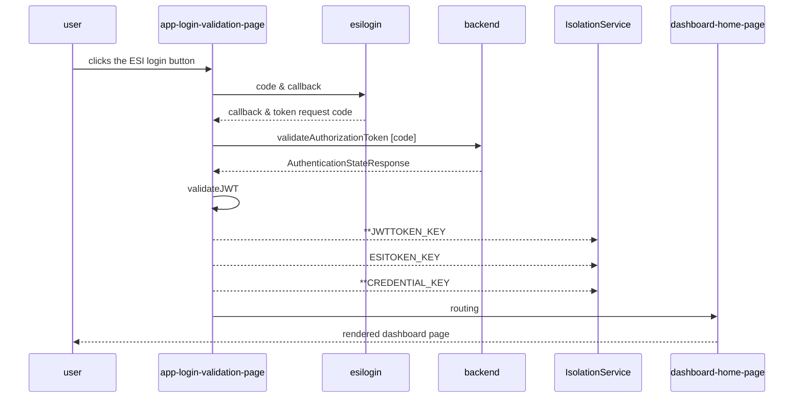
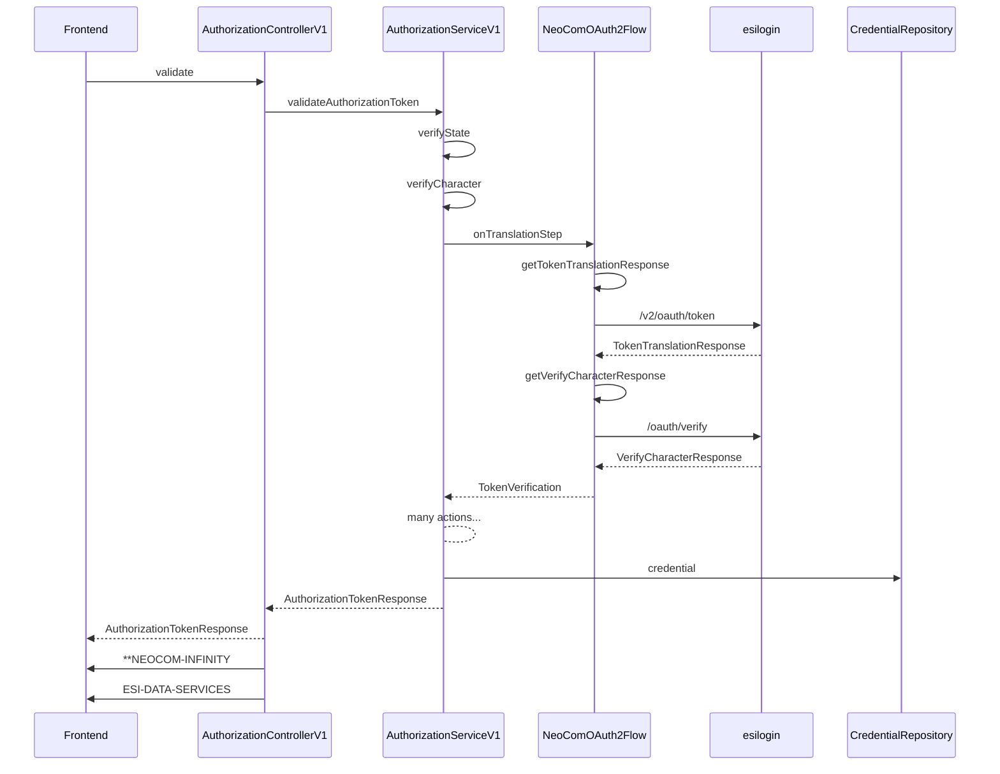
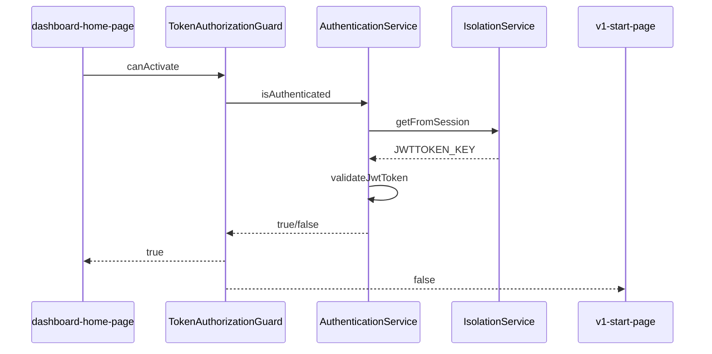
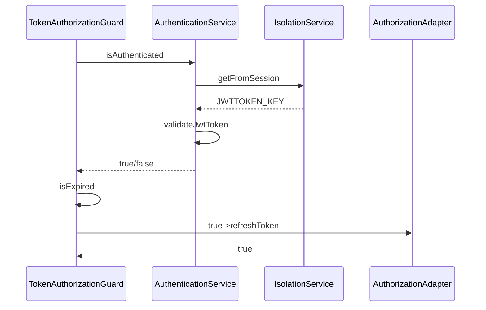
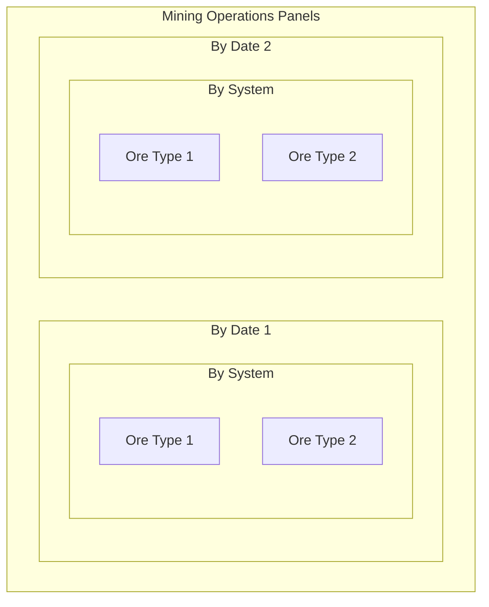
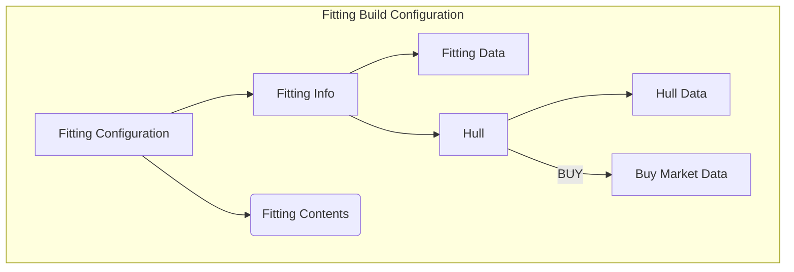
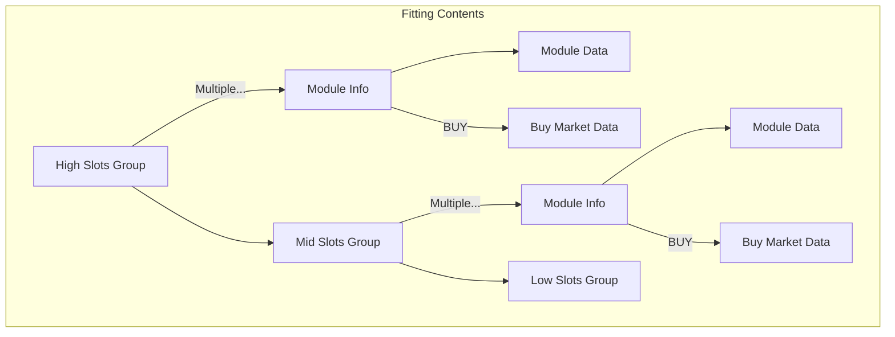

# PROJECT NEOCOM-INFINITY NOTES
## Project Status
## Project Considerations
Unit Testing should be mandatory and should not depend on active service mocks. Data access should be implemented on the unit tests and no wiremocks or other services should be required to be available.

On special cases the tests should access data sources. On such cases there should be classified under E2E tests and for running those tests there should be a command to start/stop data provider services depending on the application under test.

## Configurations
There are some soures for configurations.
* The main environment properties file that is controlled by Angular and accesible to the application as a global set of properties. This is done with file replacement on the *angular.json* environment configuration.
* Node server configuration. This is only required for the main frontend application node server and this is controlled by the *config* dependency with files stored on the */config* directory.

### Development Configuration setup
To run the fonrtend application while developing there should be some data sources active.

# Neocom Infinity Requirements
NeoCom Infinity is a new version with a reconfigured User Interface (UX) that aims to a much better user experience and also focusing on features not provided by other tools or that implemented in Infinity have a much better usability.

Developments are mainly docused on Industry and on Market improvements and leaving Fittings and other areas to a later requirement refinement.

# External Connections

# 1. Authorization Flowa
The access tot ESO data requires to be authenticated on the Eve platform. This is authorized with a OAuth2 authentication flow. The ESI services have registered some application data to create this flow.

The flow starts from the user interface with a customer request that initiates the authorization flow. We call the ***ESI login service*** (https://login.eveonline.com) with the application *unique code identifier* and the *callback URL* that should match what is configured for the registered application at ESI backend.

The current flow only support a single pilot identification. The final authorization token will be exposed as a cookie to be accesible on all subsequent requests.

The *callback* ([frontend]/app/loginValidation) is the place where the NeoCom application expected to receive one authorization code. With this code the flow should go to the OAuth flow and generate the authorization token.
Once we get the authorization code we can start navigating on the application pages.
## 1.1. Token authorization flow

The backend code flow will call the ESI authorization service and validate the response to get a new valid authorization token.
The storage of the resulting data on the local storge service is deprecated (**) since the token is available as a cookie. Only the Credential received on the response should be stored to be used to retrieve more ESI data.
## 1.2 Authorization backend process

The pages navigation will require to get access to secured data on the ESI services that requires this authorization to be valid. This is implemented with a guard process that will check is the authorization is still valid.


The NeoCom cookie is deprecated and the only element to follow with authorization is the ESI token. This token will be used on all requests to any backend.
Token expiration is one exception that should be added to the guard flow. If the token is expired there should be a new endpoint on the Java backend to generate a new token and publish it as the new cookie contents.

Then the flow will be updated to check for token expiration and initiate the generation of a new token to replace the old cookie value.



From this point on any call to the backend services (be them the Java backend or the Nest backend) will receive two cookies from the frontend. One called **NEOCOM-INFINITY has a JWT for the Java backend identification. The other named ESI-DATA-SERVICES has the ESI authorization token. This token should be updated when the token expires and the OAuth2 refresh mechanism kicks in and replaces the expired token.
## 1.3. Backend token refresh flow
THe new token refresh endpoint should go back to ESI and get a new authorization token from the current refresh token. This new token should be saven on the corresponding credential and published on the new content of the NEOCOM-COOKIE.

The next sequence diagram applies to the project **neocom-datamanagement** that is the one that contains the ESI authorization flow management.
```mermaid
sequenceDiagram
```


## 1. Industry
Industry is a key element on Eve Online and that is because is one of the most stable sources for ISK. It can be divided into two areas, Mining and Manufacturing. Recent changes on the Eve Online gameplay have added more mining functionalities that are worth to integrate on Infinity.

## 1.1 Mining Operations
Now Eve provides an endpoint to return the last ore mineral revocered by mining operations. This will make easy to see the progress on the mining schedule and budget.

The **Mining Operations** activity is under the main dashboard on the **Industry** page under the Mining Operations activation button.

The new Mining Operations Page will display one or two panels. If there are active mining operations during the current date they will be shown on the main panel. If there are no current operations then that panel is not visible.

The second panel is always visible and shows historic mining operations by date. That information is removed after some days (keeps tha tlast **30** days) from the ESI data source so it has to be persisted on the Infinity backend. This mining progress data is updated in a window of no less than **600** seconds.

The presentation selected for the mining operations is a panel for each date and systems. Minig source data comes with the classification ore->system->date. We can aggregate by date and then by system so the panel setup will be:


The aggregation then will show the list of resources mined on that date and system. Ore data is already aggregated. The panel should also show some economic information about the expected value and volume of the panel aggregation. Check if the economic data is undertandable as a whole aggregate or if there should be also some calculation at the ore level.

**[EPIC-0.21] Add Mining Operations page and functionality to see what is the input from mining.**
* **[STORY-NIN]** The backend should get the ESI data and aggregate it by system and date. For each system-date pair we generate a single Mining Operation that will contain the list of resources mined for that combination.
* **[STORY-NIN]** The backend should aggregate economic information to each of the ores on the mining operation. The economic data is the estimated value for the ore at the Amarr hub that is the predefined trading hub.
* [STORY-NIF] Volumetrics can be calculated at the frontend. For each ore the type information provides volume information that can be aggregated by ore and by system-date pair.
* **[STORY-NIF]** Date is on the format YYYY-MM-DD.
* [STORY-NIF] System information should provide the Region->Constellation->System. The hover over each of the localtion path names should provide the location unique identifier.
* [STORY-NIF] Ore box contents are still under definition. The expected content is the small icon for the ore, the ore name, the stack quantity the estimated economic value and the volume it occupies.
* [STORY-NIF] system-date panel should report information for the date, the system location path and the selected trade hub where the economic data estimation is calculated. It should also show the global volume and the global economic estimated value.

## 2. Core
### 2.1 ESI Item Type
This is an example of the heavy hierarchical data distribution inside ESI. Just ot get all the basic information about a type inside the Eve universe we need to get access to the Item, then to the Group and finally to the Category. This just is to get basic information, additional data like Market Data and other interecting informaiton should be accessed by more endpoints.

**[EPIC-0.22] Create aggregated data models for the EsiType and complementaty data.***
* [STORY-SHARED] Create the DTOs to reference the original sets from ESI.
* [STORY-NIN] Create on additional endpoint to access the EsiType structure removing hierarchy data for Group and Category.
* [STORY-NIN] Replace Mining Resource by the new EsiType and the grouping on the Stack.
* [STORY-NIF] Update the Mining Operations with the new data structures and complete the UI presentation of this data.

**[EPIC-0.23] Create new endpoint to handle Esi locations and their representation at the UX.**
* **[STORY-NIN]** Locations require additional endpoints to aggregate the location path.

## 3. FrontEnd Link Resolution
EsiType -> EsiMarkletData


## Fitting build
**Fitting Build Configuration** is a hierarchical render example. A Fitting is composed of different layers of data that are also composed of more data layers.

Starting from the Fitting data itself we found that all Fittings have an unique identifier, a name and description and apply to a specific hull class and hull type.

But if a Fitting is viewed from the Build Configuration side we have to add aggregated data like the toal build cost, the number of build jobs required and the time to build a copy.

Then at the next layer we have the hull section and the contents section. And this layer can also be divided into HIGH slots, MID slots, LOW slots, RIG slots and a different sort of Cargo bays.

Also this sections can add data if viewed from the Build Configuration view side like the Market location and transactions from where buy them or the distance from the store/buy place and the final manufacturing station or for **build** actions the bill of materials required to complete the industry job.

So each piece of data can be subdivided and can add other views data or aspects depending on the action involved, the view used to render the object or other characteristics.

Typescript class reuse should help to isolate all this aspects by providing with stubs that will only be accessed under the right view and characteristics. For example *Market information* should be an optional aspect for the *Item* access link from the central database. Or *BOM* should also be an optional link from the *Build Action*.

Project development will iterate over some different constructions until a correct set of classes, services and factories will return the best desired result for this data engineering task.

### Fitting Build Configuration
The core element has two sections, the **Fitting Info** and the **Fitting Components**. The first section included the Fitting own data plus the hull additional data. The Fitting Info has a single block of data plus an additional **Market** data block. Also there can be other additional blocks depending on the *build action* selected for the hull.

The second section has a block of data for each fitting composition module. Each of those modules are located on a group block and the number of blocks depends on ship and fitting contents. Each composition module also can have additional data blocks, like *market Data* for BUY actions, *BOM* for BUILD actions or *route data* for MOVE actions.

So a modularized way to view this should include an example of all the possible module/action combinations under acceptance tests to all rendering is checked and validated.

### Fitting Build Configuration. BUY starting point



This diagrams show the data dependencies for the simplest and base Fitting Build configuration where all items, from the hull to all the modules are just bought at the cheapest region market hub.

Version 0.20.0 will then cover this structure and try to render all Fitting data for this initial configuration.
