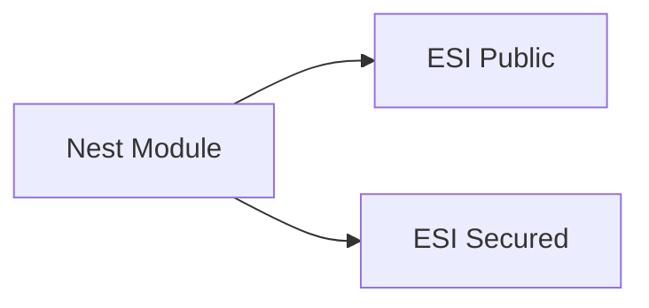
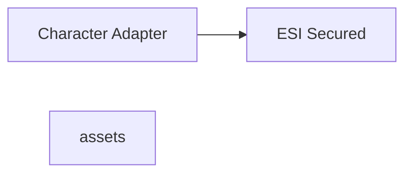

# PROJECT ARCHITECTURE

Character Adapter -> Assets Adapter -> Esi Secured

ESISecureDataServicesAdapter = covers the services that are secured
CharacterDataServicesAdapter = covers the secured services related to a character. This is the Character secion on the ESI
each of the services are inpemented like the V1MiningOperationsAdapter
